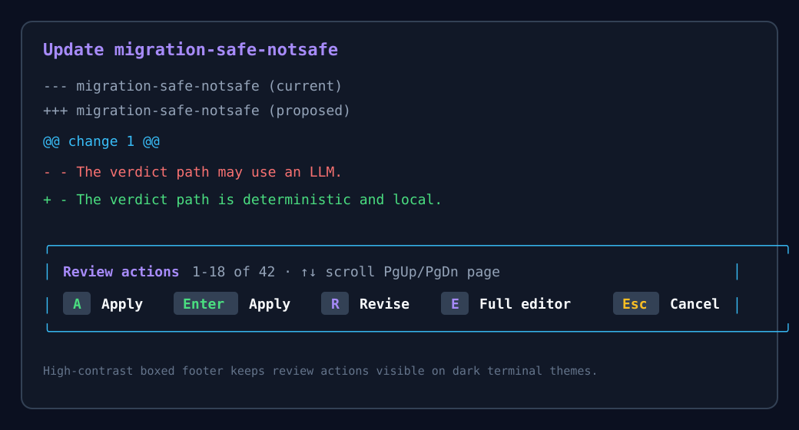

# Recall

**A local knowledge base built from your Claude Code, Codex, OpenCode, and Pi conversations.**

Recall indexes your coding-agent sessions in SQLite so you can rediscover past work, resume sessions, and preserve important context in plain Markdown. Everything stays on your machine.


## What Recall does

- Indexes conversations across Claude Code, Codex, OpenCode, and Pi.
- Searches with fuzzy matching, regular expressions, or optional local semantic search.
- Browses recent conversations and resumes supported sessions.
- Preserves reusable project context as plain Markdown context banks.
- Runs as a standalone Python CLI or as an extension inside Pi.

## Local by default

Recall reads local transcripts and indexes them with SQLite FTS5. Core indexing and search use only the Python standard library and do not send your conversations anywhere. Optional semantic search downloads and runs an embedding model locally.

Recall stores its index at `~/.recall/recall.db` and context banks under `~/.recall/contexts/`.

## Quick start

### Pi extension

Install the published [`recall-pi`](https://www.npmjs.com/package/recall-pi) package:

```bash
pi install npm:recall-pi
```

The extension adds the `/recall` dashboard and the `recall_search` and `recall_context` tools. In Pi, you can ask naturally:

```text
Search my recent sessions for the retry backoff change.
Attach my migration-safe-notsafe context before we continue.
```

### Standalone CLI

Core search has no required third-party dependencies:

```bash
python3 recall.py index
python3 recall.py search "retry backoff"
python3 recall.py recent
```

You can also install the `recall` command from this checkout. See the [usage guide](docs/usage.md) for setup and all available commands.

## Knowledge graphs

`recall graph` extracts named entities locally with a deterministic, dependency-free
heuristic and connects entities mentioned in the same message. JSON output contains
nodes, weighted co-occurrence edges, and references to the source session, message,
path, and transcript line. DOT output can be opened by Graphviz and other graph tools.

```bash
# D3/Cytoscape-friendly JSON on stdout
recall graph --max-nodes 75 --min-edge-weight 2 > graph.json

# Scope the graph and create a Graphviz artifact
recall graph --source pi --project recall --since 2026-01-01 \
  --entity-type organization --format dot --output graph.dot
dot -Tsvg graph.dot > graph.svg
```

Available scopes include `--since`, `--until`, `--source`, `--project`, and
`--entity-type`. Use `--max-nodes` and `--min-edge-weight` to keep dense graphs
readable. Entity extraction is deterministic and dependency-free, and recognizes a
small set of precise token classes rather than every capitalized word: `@people`,
`#topics`, issue references (`#123`, `gh-123`), domains, file paths, and a curated
technology gazetteer (Postgres, React, GraphQL, …). Add `--ner` to layer on spaCy
named-entity recognition for people, organizations, and places in prose:

```bash
pip install spacy && python -m spacy download en_core_web_sm
recall graph --ner
```

For an interactive explorer, render a self-contained HTML file (no server or
network needed — open it directly in a browser):

```bash
recall graph --format html --output graph.html
open graph.html
```

## Context banks

Context banks turn useful material from past conversations into reusable Markdown documents. Create, review, update, and attach them to future Pi sessions without moving your project context to a hosted service.

```bash
recall context show migration-safe-notsafe
recall context update migration-safe-notsafe "Record the latest parser and rules-engine decisions"
```



## Documentation

- [Usage, installation, semantic search, and context banks](docs/usage.md)
- [Development and architecture](docs/development.md)
- [Release cadence and deployment](docs/releases.md)
