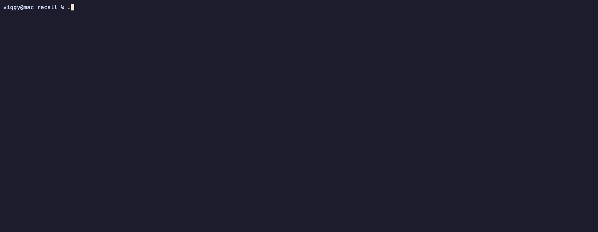

# recall

`recall` is a local work-memory tool for coding-agent sessions. It indexes local JSONL transcripts from Claude Code, Pi, and Codex into a SQLite database so you can search prior work, resume sessions, and manage reusable Markdown context banks.

Core fuzzy/regex search and indexing use only the Python standard library. Semantic search is optional and local-only via `fastembed` and `numpy`.



## Choose your workflow

| Use case | Best path | Notes |
| --- | --- | --- |
| Search from any terminal | Standalone CLI | No install required for fuzzy/regex search; optional editable install gives you the `recall` command. |
| Search while working in Pi | Pi extension | Adds `/recall` plus `recall_search` and `recall_context` tools inside Pi. |
| Keep reusable project memory | Context banks | Markdown files live locally and can be created, updated, attached, imported, or exported. |

## What it indexes

- Claude Code transcripts under `~/.claude/projects`
- Pi sessions under `~/.pi/agent/sessions` or `PI_CODING_AGENT_SESSION_DIR`
- Codex sessions under `$CODEX_HOME/sessions` or `~/.codex/sessions`

State is stored under `~/.recall`:

- `~/.recall/recall.db` — SQLite index
- `~/.recall/contexts/` — reusable Markdown context banks

## Install and dependency management

### No-install core usage

The core CLI has no required third-party Python packages:

```bash
python3 recall.py search "deadlock investigation"
python3 recall.py index
```

### Standalone CLI install

Use a virtual environment so Python dependencies stay isolated:

```bash
python3 -m venv .venv
source .venv/bin/activate
pip install -e .
recall --help
```

Update an editable install with `git pull` in the checkout. If you installed from a package archive, reinstall the newer package into the same virtual environment.

### Optional semantic search dependencies

Semantic search/indexing requires `fastembed` and `numpy`. Install them with the `semantic` extra:

```bash
python3 -m venv .venv
source .venv/bin/activate
pip install -e ".[semantic]"
recall index --semantic
recall search --semantic "why did we change the retry logic"
```

If you do not want to install the package itself, you can install only the optional dependencies into your active environment:

```bash
pip install -r requirements-semantic.txt
python3 recall.py index --semantic
```

The Python package metadata lives in `pyproject.toml`. The optional dependency group is:

```toml
[project.optional-dependencies]
semantic = ["fastembed", "numpy"]
```

## Pi extension mode

This package includes a Pi extension at `extensions/recall/index.ts`.

Install or update the Pi package from this checkout:

```bash
pi extension install /path/to/recall
pi extension update recall
```

It provides:

- `/recall` — interactive dashboard for search, recent sessions, contexts, and maintenance
- `recall_search` — tool for searching local session history
- `recall_context` — tool for listing, showing, attaching, or saving context banks

The extension runs the bundled `recall.py` backend. Python selection order is:

1. `RECALL_PYTHON`, if set
2. `.venv/bin/python` inside the package root, if present
3. `python3`

For semantic search in Pi extension mode, install the optional Python dependencies into a Python that the extension will use. Recommended local package venv:

```bash
cd /path/to/recall-package
python3 -m venv .venv
source .venv/bin/activate
pip install -e ".[semantic]"
```

Or point Pi at another Python environment:

```bash
export RECALL_PYTHON=/absolute/path/to/venv/bin/python
```

In Pi, you can ask naturally:

```text
Search my recent sessions for the retry backoff change.
Create an events-db context that tracks decisions and open questions.
Attach the events-db context before we continue the migration.
Update my events-db context with the production rollout notes.
```

## CLI usage

```bash
recall --help
recall index
recall search "deadlock investigation"
recall search --regex "IndexError|sqlite3"
recall search --semantic "why did we change the retry logic"
recall recent
recall tui
```

Search options include source, project, role, date range, result limit, JSON output, and typo-tolerant fuzzy matching.

```bash
recall search "migration plan" --source pi --project recall --role user --limit 20 --json
```

If you have not installed the package, replace `recall` with `python3 recall.py` in the commands above.

## Context banks

`recall` can create, import, export, edit, delete, and generate reusable Markdown context files.

```bash
recall context create events-db "Track the durable state, decisions, and open questions for the Events DB"
recall context create scratch --blank
recall context list
recall context show events-db
recall context path events-db
recall context update events-db "The migration is complete; remove the resolved open question."
recall context undo events-db
recall context import ./handoff.md --name events-db
recall context export events-db ./events-db.md
recall context delete events-db --force
recall context generate events-db --session <session-id-prefix>
```

`context create` and `context update` use natural-language descriptions, show a focused preview, and offer Apply, Revise, Full editor, or Cancel in the same command. Use `create --blank` for the old empty template; creation no longer requires session IDs. For model-free update scripts, repeat `--replace OLD NEW`. In Pi, ask naturally (for example, “Create an events-db context that tracks…” or “Update my events-db context: …”); the `recall_context` tool runs the same review and approval flow without a separate apply step.

Context files are stored as plain Markdown under `~/.recall/contexts/`. Previous versions are kept under `~/.recall/context-history/`, and the SQLite search index stays in `~/.recall/recall.db`.

## Privacy

`recall` reads local transcript files and writes a local SQLite index. Core indexing, fuzzy search, regex search, and context-bank management do not send transcript content over the network. Optional semantic search downloads and runs the configured embedding model locally through `fastembed`; embeddings are stored in the local database.

## Development

Run the test suite with:

```bash
python3 -m unittest -v
```

## Release cadence and deployment

Normal changes merge to `main` without publishing immediately. Use conventional commits (`feat:`, `fix:`, etc.); when you are ready to prepare a release, manually run the `Release Please` workflow. It opens or updates a reviewable release PR with the next version, changelog, and synchronized `package.json` / `pyproject.toml` updates. Merge that release PR when you want to cut a release, typically after a small batch of user-visible fixes or immediately for an urgent fix.

Merging the release PR creates a GitHub release and tag. The npm publish workflow runs only for that release tag (or by `workflow_dispatch` against an existing tag), reruns tests/type checking/package inspection, publishes `recall-pi` from the checked-out tag, then reads npm back and verifies the version, integrity, tarball URL, and required files.

Maintainer checklist:

1. Merge conventional commits normally.
2. Manually run the `Release Please` workflow when ready to prepare a release PR.
3. Review and merge the generated Release Please PR when ready to ship.
4. Watch the `Publish npm package` workflow.
5. Confirm the workflow's npm read-back verification succeeded.
6. For urgent recovery, rerun `workflow_dispatch` against an existing release tag instead of publishing from a laptop.

Configure npm trusted publishing for `recall-pi` to trust this repository's `publish-npm.yml` workflow. If OIDC trusted publishing is unavailable, use a granular npm automation token as a temporary fallback and rotate it after the recovery publish.
