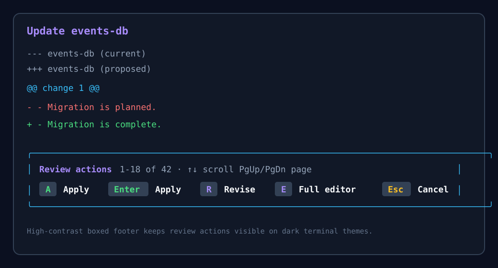

# Recall

**A local knowledge base built from your Claude Code, Codex, OpenCode, and Pi conversations.**

Recall indexes your coding-agent sessions in SQLite so you can rediscover past work, resume sessions, and preserve important context in plain Markdown. Everything stays on your machine.


## What Recall does

- Indexes conversations across Claude Code, Codex, OpenCode, and Pi.
- Searches with fuzzy matching, regular expressions, or optional local semantic search.
- Browses recent conversations and resumes supported sessions.
- Preserves reusable project context as plain Markdown context banks.
- Runs as a standalone Python CLI or as an extension inside Pi.

## Local by default

Recall reads local transcripts and indexes them with SQLite FTS5. Core indexing and search use only the Python standard library and do not send your conversations anywhere. Optional semantic search downloads and runs an embedding model locally.

Recall stores its index at `~/.recall/recall.db` and context banks under `~/.recall/contexts/`.

## Quick start

### Pi extension

Install the published [`recall-pi`](https://www.npmjs.com/package/recall-pi) package:

```bash
pi install npm:recall-pi
```

The extension adds the `/recall` dashboard and the `recall_search` and `recall_context` tools. In Pi, you can ask naturally:

```text
Search my recent sessions for the retry backoff change.
Create an events-db context that tracks open questions.
```

### Standalone CLI

Core search has no required third-party dependencies:

```bash
python3 recall.py index
python3 recall.py search "retry backoff"
python3 recall.py recent
```

You can also install the `recall` command from this checkout. See the [usage guide](docs/usage.md) for setup and all available commands.

## Context banks

Context banks turn useful material from past conversations into reusable Markdown documents. Create, review, update, and attach them to future Pi sessions without moving your project context to a hosted service.

```bash
recall context create events-db "Track the durable state and open questions"
recall context update events-db "The migration is complete"
```



## Documentation

- [Usage, installation, semantic search, and context banks](docs/usage.md)
- [Development and architecture](docs/development.md)
- [Release cadence and deployment](docs/releases.md)
